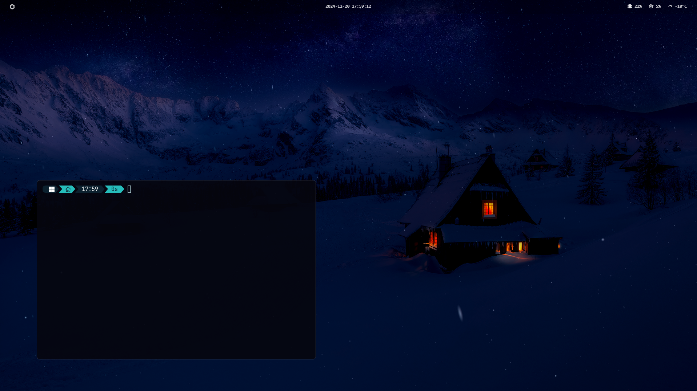

# Windows theme
Some tools and files I use for making Windows 11 look my way.

[](./)

## AtlasOS
I use AtlasOS to make Windows more performant, usable, and privacy-friendly. You can download it [here](https://atlasos.net/).

## Custom cursor
I use a custom cursor from [this](https://github.com/antiden/macOS-cursors-for-Windows) repository.

1. Download the repository.
2. Install with Install.inf. (Right-click on Install.inf and click Install)
3. Go to Settings > Devices > Mouse > Additional mouse options > Pointers > Browse and select the cursor you want.

## Topbar
I use Zebar to make the topbar look like linux. You can download it [here](https://github.com/glzr-io/zebar).

To configure Zebar:

1. Copy [top-bar](./top-bar) folder to Zebar directory
```
~/.glzr/zebar/
```

2. Desactivate the default theme and activate the vanilla-clear theme from the Zebar settings gui.

* You can open the Zebar setting gui from the taskbar icon.

## Default Taskbar
I just hide it.

## Windows Manager
I use FancyZones from [PowerToys](https://github.com/microsoft/PowerToys) to manage windows.

1. Download PowerToys from the releases page.
2. Install PowerToys.
3. Open PowerToys and go to FancyZones.
4. Create a custom layout and apply it.

* With that when I drag a window and click on Shift, I can snap it to the zones.

## Search
I use PowerToys Run from [PowerToys](https://github.com/microsoft/PowerToys) to search for apps, files, and more.

## Terminal
I use WizTerm. You can download it [here](https://wezfurlong.org/wezterm/index.html).

To configure WizTerm:

1. Copy the content only of [terminal](./terminal) folder to your home directory. (C:\Users\your-username)
2. Simply run the terminal and it will automatically load the configuration.

## Nice terminal
I use Oh My Posh to make the terminal look better. You can download it [here](https://ohmyposh.dev/).

To configure Oh My Posh:

1. Install Oh My Posh. (You can install it with the following command)
```
winget install JanDeDobbeleer.OhMyPosh -s winget
```
2. Copy the content of [oh-my-posh](./oh-my-posh) folder to your home directory. (C:\Users\your-username)
3. Open WizTerm and run the following command to create the profile.
```
New-Item -Path $PROFILE -Type File -Force
```
4. Open the profile with Notepad.
```
notepad $PROFILE
```
5. Add the following lines to the profile.
```
oh-my-posh init pwsh --config ~/hyko2024.omp.json | Invoke-Expression
```
6. Save the profile and restart the terminal.

## Wallpaper
I use Wallpaper Engine to set a live wallpaper. You can download it [here](https://store.steampowered.com/app/431960/Wallpaper_Engine/).