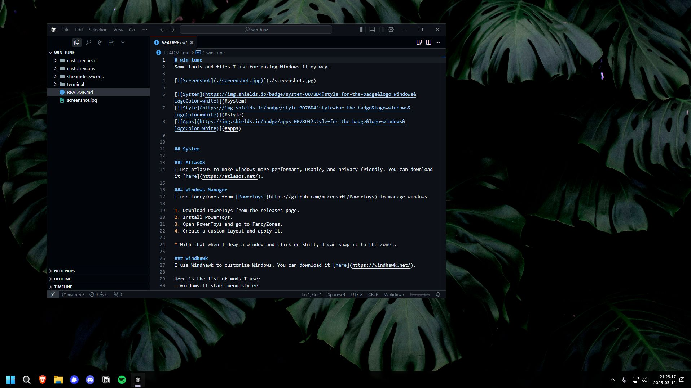

# win-tune
Some tools and files I use for making Windows 11 my way.

## System

### AtlasOS
I use AtlasOS to make Windows more performant, usable, and privacy-friendly. You can download it [here](https://atlasos.net/).

### Windows Manager
I use FancyZones from [PowerToys](https://github.com/microsoft/PowerToys) to manage windows.

1. Download PowerToys from the releases page.
2. Install PowerToys.
3. Open PowerToys and go to FancyZones.
4. Create a custom layout and apply it.

* With that when I drag a window and click on Shift, I can snap it to the zones.

### Windhawk
I use Windhawk to customize Windows. You can download it [here](https://windhawk.net/).

Here is the list of mods I use:
- windows-11-start-menu-styler
- disable-rounded-corners

## Style

### Taskbar
I use TranslucentTB to make the taskbar transparent. You can download it [here](https://github.com/TranslucentTB/TranslucentTB).

### Wallpaper
I use Wallpaper Engine to set a live wallpaper. You can download it [here](https://store.steampowered.com/app/431960/Wallpaper_Engine/).

Here is the wallpaper on the screenshot: [https://steamcommunity.com/sharedfiles/filedetails/?id=2181619161](https://steamcommunity.com/sharedfiles/filedetails/?id=2181619161)

### Custom apps icons
I use custom icons for some apps.

Simply replace the icon in the properties of the app.

### Custom cursor
Sometimes I use a custom cursor from [this](https://github.com/antiden/macOS-cursors-for-Windows) repository.

1. Download the repository.
2. Install with Install.inf. (Right-click on Install.inf and click Install)
3. Go to Settings > Devices > Mouse > Additional mouse options > Pointers > Browse and select the cursor you want.

I use the one with the shadow.

## Apps

### Browser
I use [Brave](https://brave.com/) as my browser.

Here is the theme I use: [Into The Black Hole](https://chromewebstore.google.com/detail/into-the-black-hole-true/faeadnfmdfamenfhaipofoffijhlnkif)

Here is some extensions I use: [1Password](https://chromewebstore.google.com/detail/1password-%E2%80%93-gestionnaire/aeblfdkhhhdcdjpifhhbdiojplfjncoa),
[Surfshark](https://chromewebstore.google.com/detail/extension-surfshark-vpn/ailoabdmgclmfmhdagmlohpjlbpffblp)

### Code editor
I use [Cursor](https://www.cursor.com/) as my code editor.

Here is the theme I use: [GitHub Theme](https://marketplace.visualstudio.com/items?itemName=GitHub.github-vscode-theme)

Here is some extensions I use: [Material Icon Theme](https://marketplace.visualstudio.com/items?itemName=PKief.material-icon-theme),
[Tailwind CSS IntelliSense](https://marketplace.visualstudio.com/items?itemName=bradlc.vscode-tailwindcss),
[ES7+ React/Redux/React-Native snippets](https://marketplace.visualstudio.com/items?itemName=dsznajder.es7-react-js-snippets),
[GitHub Actions](https://marketplace.visualstudio.com/items?itemName=GitHub.vscode-github-actions),

### Terminal
I use WizTerm. You can download it [here](https://wezfurlong.org/wezterm/index.html).

To configure WizTerm:

1. Copy the content only of [terminal](./terminal) folder to your home directory. (C:\Users\your-username)
2. Simply run the terminal and it will automatically load the configuration.

### Chat
I use [Discord](https://discord.com/) as my chat app and [Vencord](https://vencord.dev/) to customize it.

### Other apps
[Github Desktop](https://desktop.github.com/),
[Spotify](https://www.spotify.com/),
[Steam](https://store.steampowered.com/),
[1Password](https://1password.com/),
[Notion](https://www.notion.so/),
[Figma](https://www.figma.com/),
[Surfshark](https://www.surfshark.com/),
[F.lux](https://justgetflux.com/)